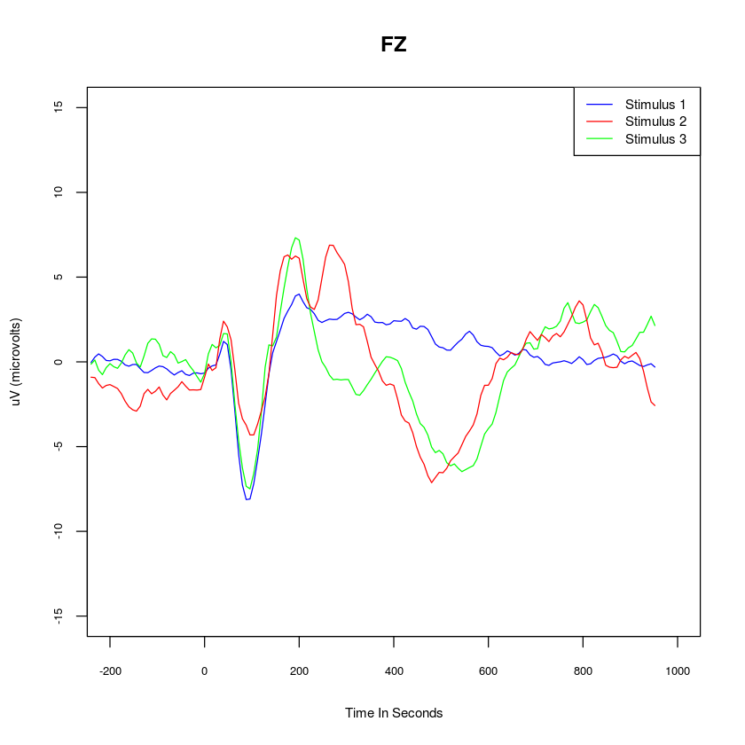
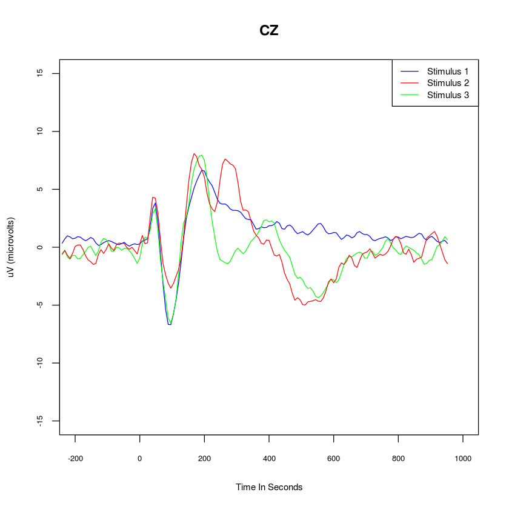
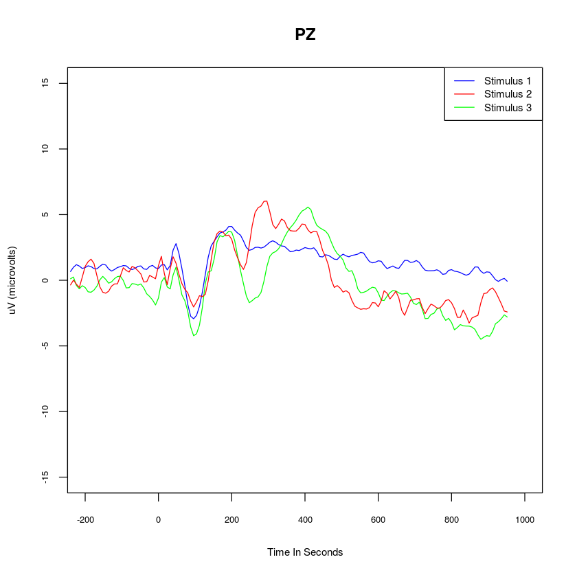

# ERPs in R

The following script will take data files output by the *COGNISION(tm)* EEG system developed by [Neuronetrix](http://neuronetrix.com/cognision-i-26.html). The script find the grand average, and plot the resulting event-related potentials (ERPs). The Cognision system is a 7-electrode system used for both clinical and research purposes. In this example, we take the grand average of all the midline electrodes (FZ, CZ, PZ) from five individuals.

**First, import all the important libraries you need.** Specifically with respect to dialog boxes and data manipulation.


```R
library(readxl)
library(plyr)
```

**Next, set your working directory.**


```R
setwd('/media/mihcelle/ChelleUSB/Cognision')
```

**Now we want to read in all the files that end in .xlsx in that directory.** We can achieve that using the `list.files` function. Specifically we set the pattern "*.xlsx" to find all files ending in .xlsx. We could swap it out with .csv if we chose to.


```R
file_list <- list.files(pattern = "*.xlsx")
print(file_list)
```

    [1] "2490_1572_average.xlsx" "2504_2098_average.xlsx" "2514_1748_average.xlsx"
    [4] "2536_1455_average.xlsx" "3097_1981_average.xlsx"


**We have to create a function that will read in sheet #3 for each .xlsx file.** The third sheet has all the data we need. We need to create a function to do this for later on (you'll see in the next few steps). Here, we create a function called `read_excel_sheet()`.


```R
read_excel_sheet <- function(x){
  sheet = 3
  read_excel(x, sheet = sheet)
}
```

**All .xlsx files will be read into a list.** This list will consist of multiple data frames, with each data frame corresponding to a subject's data. The list is named `myfiles`. Here, we use the `lapply` function to read in all the .xlsx files, the call the `read_excel_sheet` function to work it's magic.


```R
myfiles <- lapply(file_list, read_excel_sheet)
head(myfiles[[1]],10)
```


<table>
<thead><tr><th scope=col>Time</th><th scope=col>FZ</th><th scope=col>CZ</th><th scope=col>PZ</th><th scope=col>F3</th><th scope=col>P3</th><th scope=col>F4</th><th scope=col>P4</th><th scope=col>Stimulus</th></tr></thead>
<tbody>
	<tr><td>-240        </td><td>1.452119    </td><td>1.0803593   </td><td>1.959820    </td><td>0.964300    </td><td> 0.67854448 </td><td>0.6114983   </td><td> 0.494051829</td><td>1           </td></tr>
	<tr><td>-232        </td><td>1.666204    </td><td>1.1622018   </td><td>1.883526    </td><td>1.338371    </td><td> 0.92314748 </td><td>0.9929680   </td><td> 0.293375691</td><td>1           </td></tr>
	<tr><td>-224        </td><td>1.486798    </td><td>1.0600142   </td><td>1.821104    </td><td>1.383223    </td><td> 0.85471411 </td><td>0.5527750   </td><td> 0.119055512</td><td>1           </td></tr>
	<tr><td>-216        </td><td>1.253292    </td><td>1.0179369   </td><td>2.010683    </td><td>1.089607    </td><td> 0.80246432 </td><td>0.1995110   </td><td> 0.331291423</td><td>1           </td></tr>
	<tr><td>-208        </td><td>1.196881    </td><td>1.0960804   </td><td>2.064782    </td><td>1.017012    </td><td> 0.72940708 </td><td>0.4330167   </td><td> 0.385390735</td><td>1           </td></tr>
	<tr><td>-200        </td><td>1.176073    </td><td>1.1834717   </td><td>1.985252    </td><td>1.092844    </td><td> 0.93054571 </td><td>0.4191451   </td><td> 0.230028542</td><td>1           </td></tr>
	<tr><td>-192        </td><td>1.271788    </td><td>1.2819602   </td><td>2.022705    </td><td>1.228786    </td><td> 1.39616996 </td><td>0.2762673   </td><td> 0.247599264</td><td>1           </td></tr>
	<tr><td>-184        </td><td>1.447957    </td><td>1.1395449   </td><td>1.800297    </td><td>1.343458    </td><td> 1.05169124 </td><td>0.5754321   </td><td>-0.005789109</td><td>1           </td></tr>
	<tr><td>-176        </td><td>1.378599    </td><td>0.7372677   </td><td>1.239883    </td><td>1.280573    </td><td> 0.06865528 </td><td>0.9689239   </td><td>-0.555567928</td><td>1           </td></tr>
	<tr><td>-168        </td><td>1.230173    </td><td>0.6734582   </td><td>1.176998    </td><td>1.099780    </td><td>-0.02382222 </td><td>0.8685858   </td><td>-0.575450552</td><td>1           </td></tr>
</tbody>
</table>


**We now make use of `plyr`** Specifically the `aaply` and `laply` functions in plyr. `aaply` will split an array, apply a function, then return it as an array (in our case, a matrix). We embed the `laply` function because we want to iterate across a set of data.frames in a list. 

**Ultimately, what this will do is find the element means for all cells across ALL data frames in the list.** This will result in a single data frame of grand averages. The grand average data frame is titled `averages`.


```R
averages <- aaply(laply(myfiles, as.matrix), c(2,3), mean)
averages <- as.data.frame(averages)
head(averages, 10)
```


<table>
<thead><tr><th scope=col>Time</th><th scope=col>FZ</th><th scope=col>CZ</th><th scope=col>PZ</th><th scope=col>F3</th><th scope=col>P3</th><th scope=col>F4</th><th scope=col>P4</th><th scope=col>Stimulus</th></tr></thead>
<tbody>
	<tr><td>-240       </td><td>-0.03982083</td><td>0.3496945  </td><td>0.6680020  </td><td>0.007620148</td><td>0.4417096  </td><td>-0.04758894</td><td>0.5582312  </td><td>1          </td></tr>
	<tr><td>-232       </td><td> 0.27774694</td><td>0.7235810  </td><td>0.9916733  </td><td>0.498490760</td><td>0.8350164  </td><td> 0.21809895</td><td>0.8020944  </td><td>1          </td></tr>
	<tr><td>-224       </td><td> 0.46991522</td><td>0.9843676  </td><td>1.1883730  </td><td>0.690751512</td><td>1.0950632  </td><td> 0.32565029</td><td>0.9287886  </td><td>1          </td></tr>
	<tr><td>-216       </td><td> 0.31612512</td><td>0.8956817  </td><td>1.0820238  </td><td>0.389829698</td><td>0.8434319  </td><td> 0.11859316</td><td>0.7878529  </td><td>1          </td></tr>
	<tr><td>-208       </td><td> 0.08104728</td><td>0.7307943  </td><td>0.9000281  </td><td>0.180923008</td><td>0.4983058  </td><td>-0.14154609</td><td>0.6327681  </td><td>1          </td></tr>
	<tr><td>-200       </td><td> 0.06162700</td><td>0.7772180  </td><td>0.9642075  </td><td>0.328609567</td><td>0.6398889  </td><td>-0.21469578</td><td>0.6304562  </td><td>1          </td></tr>
	<tr><td>-192       </td><td> 0.14911074</td><td>0.9134373  </td><td>1.1009817  </td><td>0.558971055</td><td>0.9081661  </td><td>-0.12397537</td><td>0.6300863  </td><td>1          </td></tr>
	<tr><td>-184       </td><td> 0.14587402</td><td>0.8741344  </td><td>1.0436457  </td><td>0.679654199</td><td>0.8442642  </td><td>-0.04315002</td><td>0.4560436  </td><td>1          </td></tr>
	<tr><td>-176       </td><td> 0.03462356</td><td>0.6990745  </td><td>0.8907804  </td><td>0.581905489</td><td>0.5718254  </td><td>-0.10122587</td><td>0.2760823  </td><td>1          </td></tr>
	<tr><td>-168       </td><td>-0.18038664</td><td>0.5577688  </td><td>0.8659039  </td><td>0.340539179</td><td>0.4932195  </td><td>-0.28155705</td><td>0.3201941  </td><td>1          </td></tr>
</tbody>
</table>


**Now we utilize the `subset` function to split the dataframe to their respective stimulus numbers**. The subset function goes as follows: x<-subset(data_frame, "argument to subset"). In our example, we subset `averages`, and set the subsetting argument sutch that the Stimulus column is equal to 1, 2, or 3. These are assigned to `stim_1_avg`, `stim_2_avg`, `stim_3_avg` respectively.


```R
stim_1_avg <- subset(averages, averages$Stimulus == 1)
stim_2_avg <- subset(averages, averages$Stimulus == 2)
stim_3_avg <- subset(averages, averages$Stimulus == 3)
```

**Finally, we get to plotting.** We use the basic base-R plotting functions here, but you could use the `ggplot` package if you wanted nicer plots. Each plot has a lot of arguments, so check out ?plot, ?lines, and ?legend to understand them. I'll go through the plots more generally step by step.

`plot()` calls the plotting function. Note we first build the plot using the `stim_1_avg` data first. The `lines()` function will overlay additional lines on the original plot, in this case, using `stim_avg_2`. We do the same with `stim_avg_3`. Note that we call the "Time" and "FZ" columns to plot.

`line_names()` specifies the line names for a legend. `legend()` will place a legend on the figure, consisting of our line names (which is used in the argument.)

**Running all this, we get our plot for FZ below!**


```R
plot(stim_1_avg[c("Time", "FZ")], type = 'l', xlab = "Time In Seconds", ylab = "uV (microvolts)", xlim=c(-200,1000), ylim=c(-15,15), main = "FZ", col = "blue", cex.lab = .75, cex.axis = .65)
lines(stim_2_avg[c("Time", "FZ")], col = "green")
lines(stim_3_avg[c("Time", "FZ")], col = "red")
line_names <-c("Stimulus 1", "Stimulus 2", "Stimulus 3")
legend('topright', line_names, col = c("blue", "red", "green"), lty = 1, cex = .75)
```





**We can do the same for plotting CZ.**


```R
plot(stim_1_avg[c("Time", "CZ")], type = 'l', xlab = "Time In Seconds", ylab = "uV (microvolts)", xlim=c(-200,1000), ylim=c(-15,15), main = "CZ", col = "blue", cex.lab = .75, cex.axis = .65)
lines(stim_2_avg[c("Time", "CZ")], col = "green")
lines(stim_3_avg[c("Time", "CZ")], col = "red")
line_names <-c("Stimulus 1", "Stimulus 2", "Stimulus 3")
legend('topright', line_names, col = c("blue", "red", "green"), lty = 1, cex = .75)
```





**And PZ!**


```R
plot(stim_1_avg[c("Time", "PZ")], type = 'l', xlab = "Time In Seconds", ylab = "uV (microvolts)", xlim=c(-200,1000), ylim=c(-15,15), main = "PZ", col = "blue", cex.lab = .75, cex.axis = .65)
lines(stim_2_avg[c("Time", "PZ")], col = "green")
lines(stim_3_avg[c("Time", "PZ")], col = "red")
line_names <-c("Stimulus 1", "Stimulus 2", "Stimulus 3")
legend('topright', line_names, col = c("blue", "red", "green"), lty = 1, cex = .75)
```





**So in conclusion, this script will plot grand average data with minor modifications.** I hope this is helpful!


```R

```
